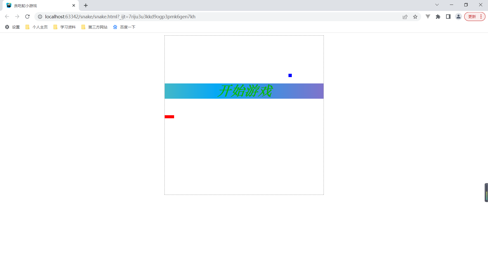
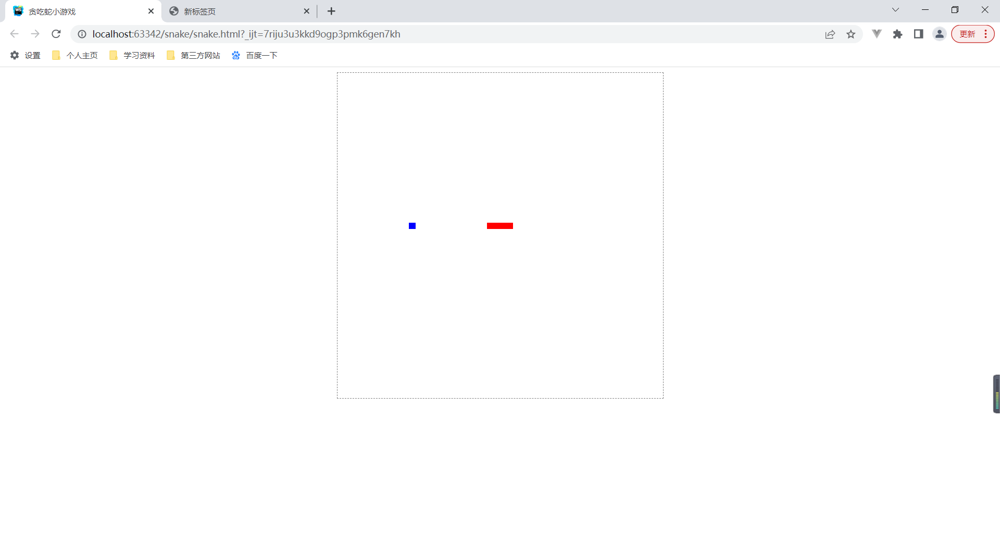
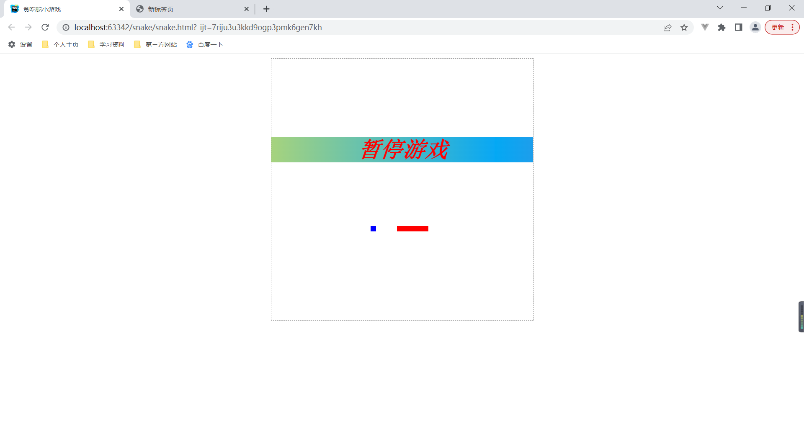
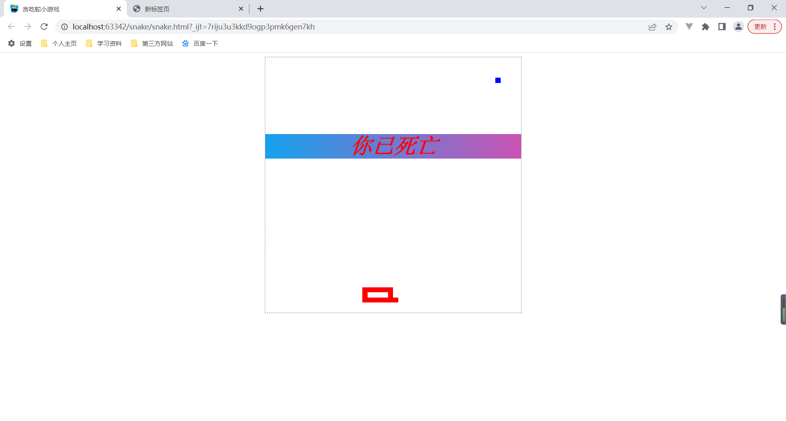

# 贪吃蛇小游戏

一个基于 `JavaScript` 的网页版贪吃蛇小游戏。

	
	

 

## 游戏开始

使用浏览器打开 `snake.html` 文件，可以看到小游戏的主界面。

按下键盘回车键，即可开始游戏，使用键盘上的上、下、左、右四个方向键，即可控制贪吃蛇移动。

## 游戏暂停

在游戏中，重新按下回车键，即可暂停游戏。

## 游戏模式

游戏一共有两种模式：

- 正常模式：该模式中迷宫墙体为真实墙体，贪吃蛇触之即死。

- 无限模式：该模式下迷宫墙体为时空间隙，贪吃蛇撞墙后，会从墙体的另一边穿越过来。

游戏模式可以通过修改 `snake.html` 文件中的 `CYCLE` 布尔常量值来修改。

| 模式 | CYCLE |
| --- | --- |
| 正常模式 | false |
| 无限模式 | true |

## 游戏死亡

| 模式 | 死亡原因 |
| --- | --- |
| 正常模式 | 撞墙、咬到自己的身体 |
| 无限模式 | 咬到自己的身体 |

## 重新开始

在任意情况下，只要按下键盘 F5 键，即可刷新网页小游戏，重新开始。
